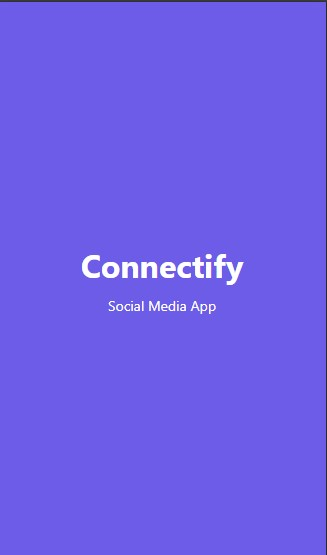
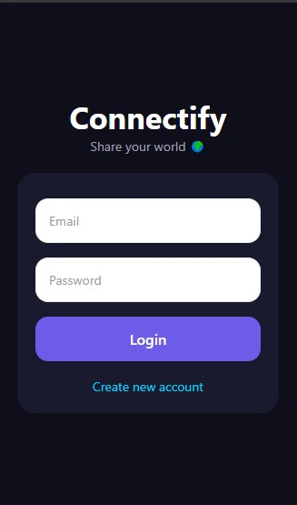
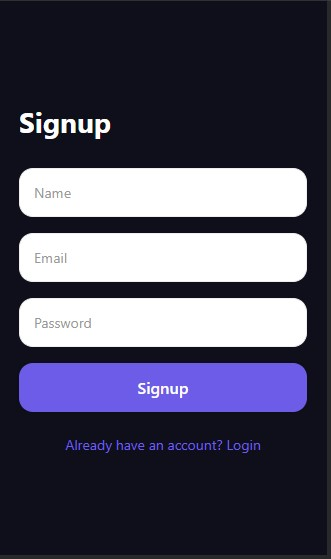
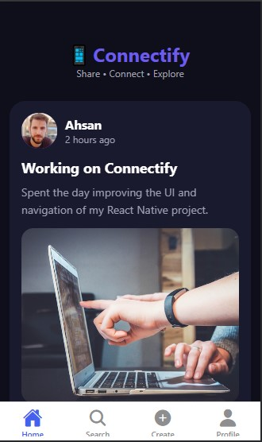
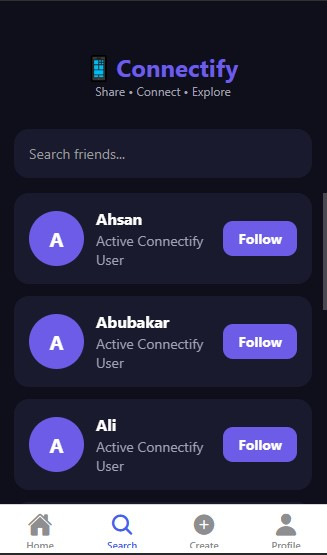
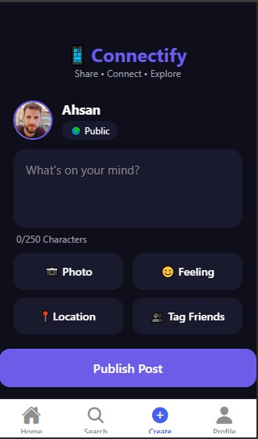
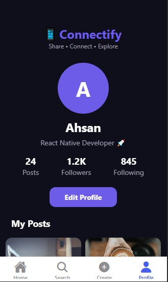

# 📱 Connectify

A modern social media mobile application built with **React Native**, **Expo**, and **TypeScript**.

Connectify is a frontend-focused social networking application. It demonstrates modern mobile UI design, reusable components, navigation, responsive layouts, and simulated social media functionality.

---

## 📸 Screens

- Splash Screen
- Login Screen
- Signup Screen
- Home Feed
- Search Friends
- Create Post
- Profile

---

## ✨ Features

- 🔐 Login & Signup UI
- 🏠 Social Media Feed
- ❤️ Like & Comment Display
- 👥 Search Friends
- 📝 Create Post Screen
- 👤 User Profile
- 📱 Responsive Mobile UI
- 🌙 Modern Dark Theme
- 🧭 Stack Navigation
- 📑 Bottom Tab Navigation
- 🖼️ Image Feed
- 🔍 Search Functionality
- ♻️ Reusable Components
- ⚡ Optimized Lists using FlatList

---

## 🛠 Tech Stack

- React Native
- Expo
- TypeScript
- React Navigation
- Axios
- JavaScript (ES6+)
- Flexbox

---

## 📂 Project Structure

```
Connectify
│
├── assets
│
├── src
│   ├── components
│   ├── constants
│   ├── context
│   ├── data
│   ├── navigation
│   ├── screens
│   └── services
│
├── App.tsx
├── package.json
└── README.md
```

---

## 📱 Navigation Flow

```
App
│
├── Splash
│
├── Login
│
├── Signup
│
└── Bottom Tabs
      │
      ├── Home
      ├── Search
      ├── Create Post
      └── Profile
```

---

## 📷 Home Feed

The Home screen displays a modern social media feed containing:

- User posts
- Images
- Likes
- Comments
- Share option

Posts are rendered using **FlatList** for better performance.

---

## 👥 Search

Users can:

- Search friends
- View user cards
- Browse suggested users

---

## ✍ Create Post

The Create Post screen allows users to:

- Write a caption
- Preview a post layout
- Simulate publishing a new post

---

## 👤 Profile

Profile includes:

- User information
- Followers
- Following
- Posts count
- Scrollable image gallery

---

## 📦 Installation

Clone the repository

```bash
git clone https://github.com/ahsanbuilds/Connectify.git
```

Go into the project

```bash
cd Connectify
```

Install dependencies

```bash
npm install
```

Run the Expo development server

```bash
npx expo start
```

---

## 🚀 Future Improvements

- Firebase Authentication
- Backend Integration
- Real-time Chat
- Push Notifications
- Image Upload
- Stories Feature
- User Follow System
- Live Comments
- Dark/Light Theme Toggle

---

## 📖 Learning Outcomes

This project demonstrates:

- React Native Fundamentals
- Mobile UI Development
- Component-Based Architecture
- Navigation
- State Management
- API-ready Structure
- Responsive Design
- Code Organization

---

## 📷 Application Preview

### Splash Screen



### Login Screen



### Signup Screen



### Home Feed



### Search



### Create Post



### Profile



## 👨‍💻 Developer

**Muhammad Ahsan**

BS Software Engineering

University of Central Punjab (UCP)

---

## 📄 License

This project is developed for educational purposes as a semester project.
